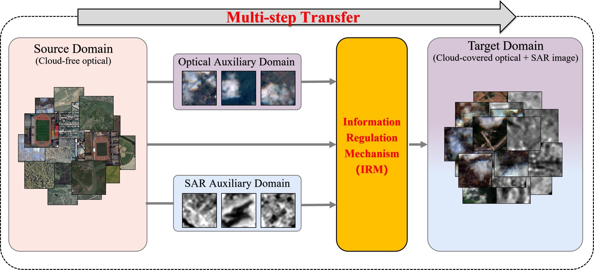
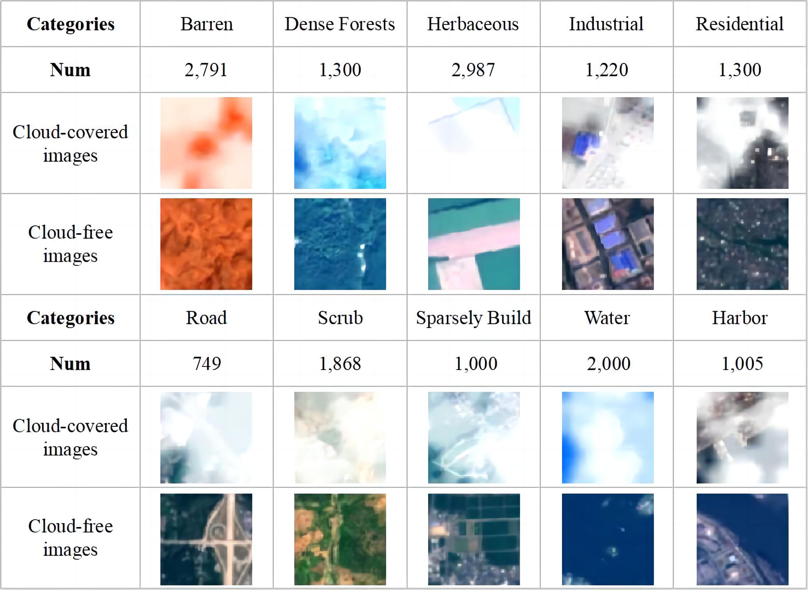
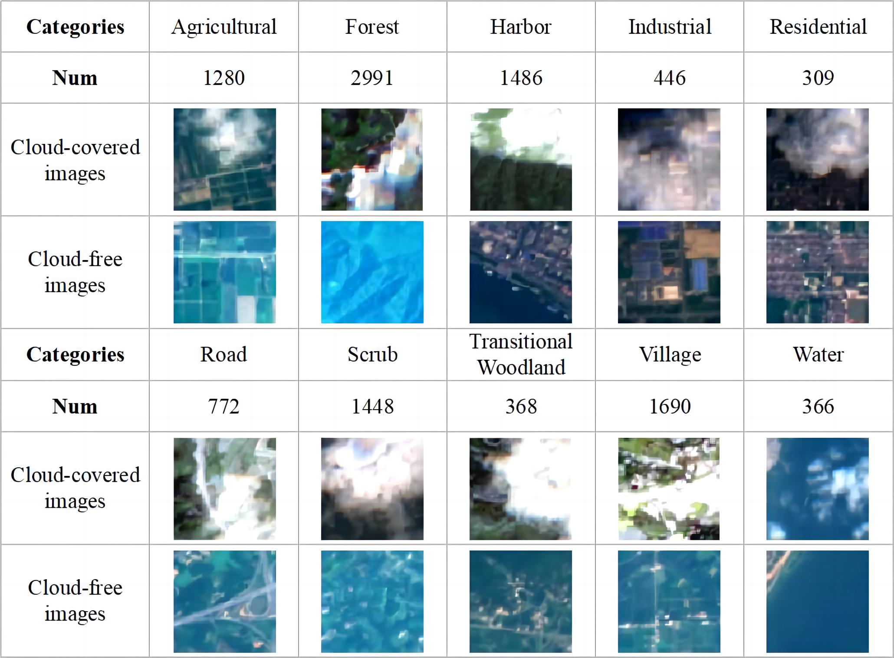

# ESCCS(Enhancing Scene Classification in Cloudy Scenarios)

Code for "Multi-Modality Transfer Learning for Cloudy Remote Sensing Images: Addressing Modality Imbalance with Knowledge Distillation"

# Abstract
In cloud-prone regions, transferring the optical source model to a cloudy target domain remains a challenge for supporting continuous monitoring. Conventional methods address it by either reconstructing the optical modality through cloud removal or utilizing the Synthetic Aperture Radar (SAR) modality. Unfortunately, the former methods require extensive cloud-free references, while the latter ignore valuable
information that may still exist in partially cloud-contaminated optical images. Therefore, we aim to develop a multi-modality transfer method for the target domain that includes partially cloud-contaminated optical and SAR data without cloud-free references. However, the varying domain gaps and cloud-cover conditions jointly cause the complex modality imbalance problem, which hinders the complementary effect of multi-modality information. The target model not only globally over-relies on the superior modality while neglecting the inferior one, but the role of each modality also locally changes with the amount of remaining optical information. To solve the problems, we introduce a multi-step transfer strategy (MTTS) with the Information Regulation Mechanism (IRM) based on knowledge distillation. The MTTS employs the additional auxiliary models to mitigate the domain gaps and quantifies the superior and inferior states of different modalities for each sample. Building on this, the IRM can dynamically adjust the contributions of each modality at the sample level within the target model’s decision-making process. This further improves its applicability, enabling continuous monitoring in cloud-prone regions. Experiments on simulated and real cloud datasets demonstrated that the proposed method outperforms state-of-the-art methods, yielding an average accuracy improvement of 14.03% in land cover scene classification.

# Dependency

Ubuntu18.04
CUDA11.3
PyToch1.12
python3.8

# Dataset

## SEN2MS 
Download(Source): https://mediatum.ub.tum.de/1474000
Precessing code: https://github.com/schmitt-muc/SEN12MS
The cloud masks will be provided upon request. 

## HunanCloud
Download: The dataset will be released after the paper is published

# Reference

## Filtering and Generation of Pseudo-Labels
In the first step of the multi-step transfer process, the source-domain model guides the auxiliary model for knowledge transfer. To ensure the reliability of the auxiliary model, we perform filtering based on the logit outputs during pseudo-label generation. This helps mitigate the effect of excessive noise and improves the stability of the learning process. For the detailed procedure, please refer to: Cross-Sensor Remote-Sensing Images Scene Understanding Based on Transfer Learning Between Heterogeneous Networks. https://ieeexplore.ieee.org/abstract/document/9570728。

In the second step of the multi-step transfer process, we did not apply filtering in order to preserve the model’s ability to repeatedly learn multi-modal balance under complex cloud-covered conditions. This choice was made because heavily cloud-contaminated samples might otherwise be incorrectly discarded as noise.

Our overall pseudo-label generation technique was inspired by Knowledge Distillation Zoo (https://github.com/AberHu/Knowledge-Distillation-Zoo).

# Compared method:

## Opt to Opt

SPL： Thick cloud removal in optical remote sensing images using a texture complexity guided self-paced learning method. reference(https://github.com/GeoX-Lab/TPL)  
KD-S (soft Knowledge Distillation): Knowledge distillation and student-teacher learning for visual intelligence: A review and new outlooks reference(https://github.com/AberHu/Knowledge-Distillation-Zoo)

## Opt to SAR
TTL: A general transitive transfer learning framework for cross-optical sensor remote sensing image scene understanding.  
CycIT: Two-stage cross-modality transfer learning method for military-civilian SAR ship recognition(Reproduced by ourselves, will be released after the paper is published)  

## Opt to Opt&SAR
KDHN: Cross-Sensor Remote-Sensing Images Scene Understanding Based on Transfer Learning Between Heterogeneous Networks(https://ieeexplore.ieee.org/abstract/document/9570728)  
TLF: A comparative review on multi-modal sensors fusion based on deep learning（Reproduced by ourselves, will be released after the paper is published）  

The code will be released after the paper is published  
